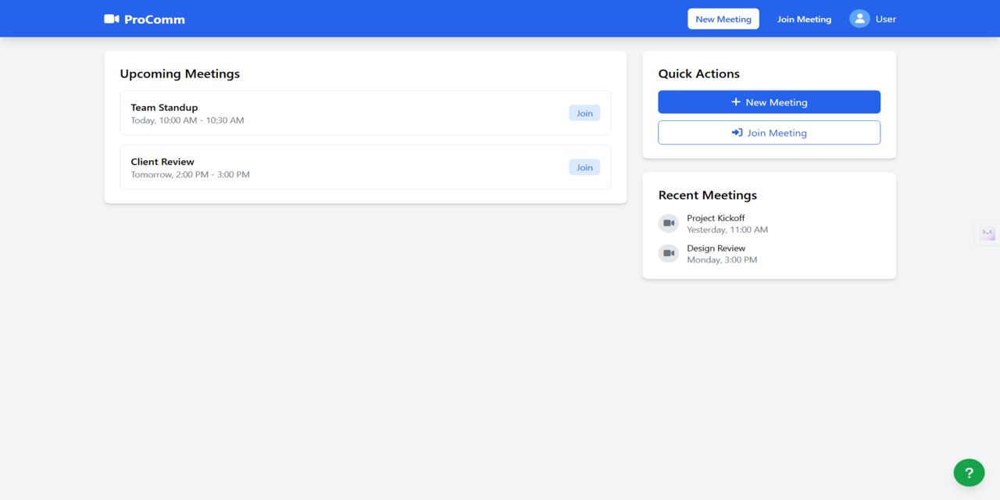

# ProComm

We are currently developing a powerful and secure Video Conference Call Web Application designed to deliver seamless virtual communication experiences. Built with a robust backend infrastructure and an intuitive, beautifully crafted user interface, our platform ensures smooth and high-quality video meetings for both personal and professional use.

> Our top priority is data privacy and security — every meeting and user interaction is protected by advanced encryption and authentication measures. The application is engineered to prevent interruptions, so you can create or join meetings without friction, from anywhere, at any time.

## 📜 License
This project is licensed under the MIT License. See the LICENSE file for details.
